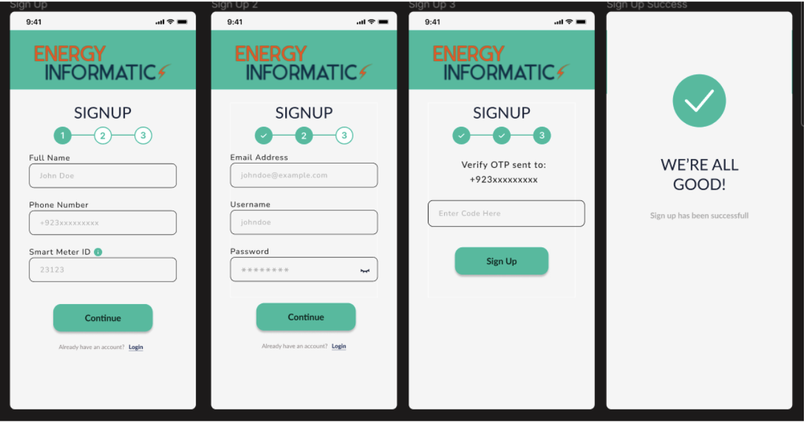
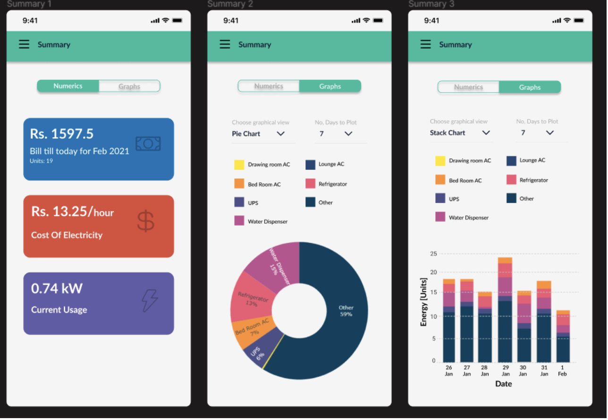
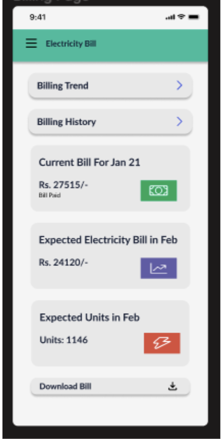
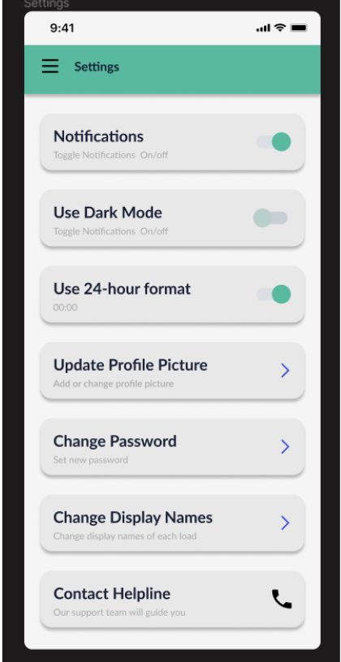

# EnergyMonitor


<!-- Improved compatibility of back to top link: See: https://github.com/othneildrew/Best-README-Template/pull/73 -->
<a name="readme-top"></a>
<!--
*** Thanks for checking out the Best-README-Template. If you have a suggestion
*** that would make this better, please fork the repo and create a pull request
*** or simply open an issue with the tag "enhancement".
*** Don't forget to give the project a star!
*** Thanks again! Now go create something AMAZING! :D
-->


<!-- PROJECT SHIELDS -->
<!--
*** I'm using markdown "reference style" links for readability.
*** Reference links are enclosed in brackets [ ] instead of parentheses ( ).
*** See the bottom of this document for the declaration of the reference variables
*** for contributors-url, forks-url, etc. This is an optional, concise syntax you may use.
*** https://www.markdownguide.org/basic-syntax/#reference-style-links
-->


<!-- PROJECT LOGO -->
<br />
<div align="center">
  <a href="https://web.lums.edu.pk/~eig/">
    
  </a>

  <h3 align="center"></h3>


</div>

<!-- TABLE OF CONTENTS -->
<details>
  <summary>Table of Contents</summary>
  <ol>
    <li>
      <a href="#about-the-project">About The Project</a>
      <ul>
        <li><a href="#built-with">Built With</a></li>
      </ul>
    </li>
    <li>
      <a href="#getting-started">Getting Started</a>
      <ul>
        <li><a href="#prerequisites">Prerequisites</a></li>
        <li><a href="#installation">Installation</a></li>
      </ul>
    </li>
    <li>
      <a href="#screens-and-features">Screens and Features</a>
      <ul>
        <li><a href="#sign-up-screens">Sign Up Screens</a></li>
        <li><a href="#navigation-sidebar">Navigation Sidebar</a></li>
        <li><a href="#summary-screen">Summary Screen</a></li>
        <li>
          <a href="#bill-screens">Bill Screens</a>
          <ul>
            <li><a href="#electricity-bill">Electricity Bill</a></li>
            <li><a href="#sub-ct-share">Sub CT Share</a></li>
          </ul>
        </li>
        <li><a href="#live-load-profile">Live Load Profile</a></li>
        <li>
          <a href="#historical-screens">Historical Screens</a>
          <ul>
            <li><a href="#historical-load">Historical Load</a></li>
          </ul>
        </li>
        <li><a href="#settings-page">Settings Page</a></li>
        <li><a href="#dark-mode-screens">Dark Mode Screens</a></li>
      </ul>
    </li>
    <li><a href="#contact">Contact</a></li>
  </ol>
</details>


<!-- ABOUT THE PROJECT -->
## About The Project

**Objectives**:
provide an easy-to-access application that can be readily checked by the users to monitor their appliances’ power consumption
provide users with informatics to see nuances such as consumption during peak hours
provide visualizations of the data in an easy-to-understand manner 
provide users access to their bill information and history

**Benefits**:
by monitoring energy consumption, users can make informed, energy efficient decisions using something as simple as a mobile on the palm of their hands
the application can aid in the safety of appliances and power systems as unusual consumption can be an indicator of faulty appliances or short circuits
the application can provide soft copies and information of the monthly bill which can provide easy access to this information

<!-- Use the `BLANK_README.md` to get started. -->

<p align="right">(<a href="#readme-top">back to top</a>)</p>


### Built With


* [![ReactNative][ReactNative.com]][ReactNative-url]
* [![MongoDB][MongoDB.com]][MongoDB-url]
* [![Expo][Expo.com]][Expo-url]
* [![Bootstrap][Bootstrap.com]][Bootstrap-url]
* [![JQuery][JQuery.com]][JQuery-url]


<p align="right">(<a href="#readme-top">back to top</a>)</p>


<!-- GETTING STARTED -->
## Getting Started


### Prerequisites

* npm
  ```sh
  npm install npm@latest -g
  ```

### Installation


1. Clone the repo
   ```sh
   git clone https://github.com/Mughees2001/EnergyMonitor---EIG
   ```
2. Install the EXPO package and dotenv
   ```sh
    npm install expo-cli --global 
    npm install dotenv --global
   ```
3. Install the Mongoose DB
   ```sh
    npm install mongoose --save
   ```
4. Add the file `config.env`  in `EnergyMonitor--EIG/server/config`

5. Install the EXPO App on your phone
   ```sh
    https://play.google.com/store/apps/details?id=host.exp.exponent&pli=1
   ```
6. Install npm in the folder `EnergyMonitor--EIG/energyInformatics`.
 ```sh
    npm install
   ```
7. Start the App in  `EnergyMonitor--EIG/energyInformatics`.
 ```sh
    npm start
   ``` 
8. Open EXPO App on your Phone and Scan the QR CODE


## Sign Up Screens

**Overview:**  
A three-step process to create an account, requiring users to input their full name, phone number, smart meter ID, email, username, and password. OTP verification completes the setup.

**Key Features:**

- **Progress Indicator**: Displays progress across steps.
- **Login Option**: Option to navigate back if already registered.
- **Info Icons**: Guide users on specific fields like Smart Meter ID.
- **Password Toggle**: View entered passwords.
- **Feedback Screens**: Confirms completion.

**Illustration:**  


---

## Navigation Sidebar

**Overview:**  
Allows users to navigate through the application's features, such as summary, bills, historical load, and settings.

**Key Features:**

- **Tabs**: Redirects to respective sections.
- **Highlighting**: Current tab is highlighted for clarity.
- **Profile Integration**: Displays profile name and logo.
- **Focus Mode**: Dulls the background to improve visibility.

**Illustration:**  


---

## Summary Screen

**Overview:**  
Provides an overview of electricity statistics with two views: "Numerics" and "Graphs."

**Key Features:**

- **Numerics**: Displays current bill, cost, and usage.
- **Graphs**: Allows selection of graph types and time periods.
- **Interactive Design**: Features tabs, dropdowns, and color-coded visuals.

**Illustration:**  


---

## Bill Screens

### Electricity Bill

**Overview:**  
Displays the current bill, expected bill, expected units, and provides an option to download the bill as a PDF.

**Key Features:**

- **Download Button**: Enables users to save bills in PDF format.
- **Navigation**: Links to billing trends and history screens.
- **Readable Cards**: Consistent design with clear visuals.

**Illustration:**  


---

### Sub CT Share

**Overview:**  
Displays power consumption per appliance using a pie chart.

**Key Features:**

- **Key Legend**: Explains color codes for appliances.
- **Readable Charts**: Well-scaled and visually intuitive.

**Illustration:**  


---

## Live Load Profile

**Overview:**  
Provides real-time graphs of electricity consumption per appliance.

**Key Features:**

- **Time Dropdowns**: Allows users to select specific time slots.
- **Interactive Graphs**: Features zoom, rotate, and expand options.
- **Component Selection**: Allows filtering via checkbox buttons.

**Illustration:**  


---

## Historical Screens

### Historical Load

**Overview:**  
Displays graphs and summaries of electrical units consumed over a selected time period.

**Key Features:**

- **Expandable Graphs**: Optimized for landscape viewing.
- **Key Legend**: Helps identify components in the graph.
- **Consistent Design**: Matches the theme of the application.

**Illustration:**  


---

## Settings Page

**Overview:**  
Allows users to modify application and account settings, such as notifications, theme, time format, profile, and display names. Provides an option to contact support.

**Key Features:**

- **Toggle Buttons**: For enabling/disabling notifications and selecting time formats.
- **Profile Settings**: Update profile picture, password, and device names.
- **Support Access**: Includes icons and navigation for contacting support.

**Illustration:**  


---

## Dark Mode Screens

**Overview:**  
Demonstrates the application's dark mode interface.

**Key Features:**

- **Contrast and Readability**: White text on dark surfaces with appropriate color contrast.
- **Depth Indication**: Shadows and varying shades highlight key elements.
- **Gradient Sidebar**: Differentiates the sidebar from the main screen.

**Illustration:**  


   

<!-- USAGE EXAMPLES
## Usage

Use this space to show useful examples of how a project can be used. Additional screenshots, code examples and demos work well in this space. You may also link to more resources.

_For more examples, please refer to the [Documentation](https://example.com)_

<p align="right">(<a href="#readme-top">back to top</a>)</p> -->


<!-- ROADMAP
## Roadmap

- [x] Add Changelog
- [x] Add back to top links
- [ ] Add Additional Templates w/ Examples
- [ ] Add "components" document to easily copy & paste sections of the readme
- [ ] Multi-language Support
    - [ ] Chinese
    - [ ] Spanish

See the [open issues](https://github.com/othneildrew/Best-README-Template/issues) for a full list of proposed features (and known issues).

<p align="right">(<a href="#readme-top">back to top</a>)</p>


<!-- CONTRIBUTING
## Contributing

Contributions are what make the open source community such an amazing place to learn, inspire, and create. Any contributions you make are **greatly appreciated**.

If you have a suggestion that would make this better, please fork the repo and create a pull request. You can also simply open an issue with the tag "enhancement".
Don't forget to give the project a star! Thanks again!

1. Fork the Project
2. Create your Feature Branch (`git checkout -b feature/AmazingFeature`)
3. Commit your Changes (`git commit -m 'Add some AmazingFeature'`)
4. Push to the Branch (`git push origin feature/AmazingFeature`)
5. Open a Pull Request

<p align="right">(<a href="#readme-top">back to top</a>)</p> -->


<!-- LICENSE
## License

Distributed under the MIT License. See `LICENSE.txt` for more information.

<p align="right">(<a href="#readme-top">back to top</a>)</p> -->


<!-- ACKNOWLEDGMENTS -->
<!-- ## Acknowledgments

Use this space to list resources you find helpful and would like to give credit to. I've included a few of my favorites to kick things off!

* [Choose an Open Source License](https://choosealicense.com)
* [GitHub Emoji Cheat Sheet](https://www.webpagefx.com/tools/emoji-cheat-sheet)
* [Malven's Flexbox Cheatsheet](https://flexbox.malven.co/)
* [Malven's Grid Cheatsheet](https://grid.malven.co/)
* [Img Shields](https://shields.io)
* [GitHub Pages](https://pages.github.com)
* [Font Awesome](https://fontawesome.com)
* [React Icons](https://react-icons.github.io/react-icons/search)

<p align="right">(<a href="#readme-top">back to top</a>)</p> --> 


<!-- MARKDOWN LINKS & IMAGES -->
<!-- https://www.markdownguide.org/basic-syntax/#reference-style-links -->
[contributors-shield]: https://img.shields.io/github/contributors/othneildrew/Best-README-Template.svg?style=for-the-badge
[contributors-url]: https://github.com/othneildrew/Best-README-Template/graphs/contributors
[forks-shield]: https://img.shields.io/github/forks/othneildrew/Best-README-Template.svg?style=for-the-badge
[forks-url]: https://github.com/othneildrew/Best-README-Template/network/members
[stars-shield]: https://img.shields.io/github/stars/othneildrew/Best-README-Template.svg?style=for-the-badge
[stars-url]: https://github.com/othneildrew/Best-README-Template/stargazers
[issues-shield]: https://img.shields.io/github/issues/othneildrew/Best-README-Template.svg?style=for-the-badge
[issues-url]: https://github.com/othneildrew/Best-README-Template/issues
[license-shield]: https://img.shields.io/github/license/othneildrew/Best-README-Template.svg?style=for-the-badge
[license-url]: https://github.com/othneildrew/Best-README-Template/blob/master/LICENSE.txt
[linkedin-shield]: https://img.shields.io/badge/-LinkedIn-black.svg?style=for-the-badge&logo=linkedin&colorB=555
[linkedin-url]: https://linkedin.com/in/othneildrew
[product-screenshot]: images/screenshot.png


[ReactNative.com]:https://img.shields.io/badge/react_native-%2320232a.svg?style=for-the-badge&logo=react&logoColor=%2361DAFB
[ReactNative-url]:https://reactnative.dev/ 

[Bootstrap.com]: https://img.shields.io/badge/Bootstrap-563D7C?style=for-the-badge&logo=bootstrap&logoColor=white
[Bootstrap-url]: https://getbootstrap.com

[JQuery.com]: https://img.shields.io/badge/jQuery-0769AD?style=for-the-badge&logo=jquery&logoColor=white
[JQuery-url]: https://jquery.com 

[MongoDB.com]: https://img.shields.io/badge/MongoDB-%234ea94b.svg?style=for-the-badge&logo=mongodb&logoColor=white
[MongoDB-url]: https://www.mongodb.com/

[Expo-url]:https://expo.dev/
[Expo.com]:https://img.shields.io/badge/expo-1C1E24?style=for-the-badge&logo=expo&logoColor=#D04A37


